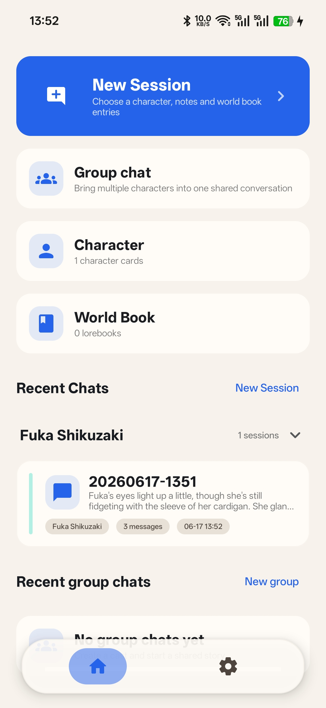
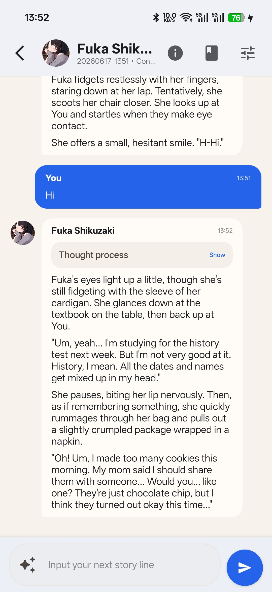

  

  # RPClient

  [简体中文](README_ZH.md) | English

  A local-first AI role-playing chat client for Android.

  Supports character cards, lorebooks, one-on-one chats, group chats, long-term summary memory, prompt inspection, and multiple LLM APIs.

  [Overview](#overview) · [Screenshots](#screenshots) · [Features](#features) · [Quick Start](#quick-start) · [Contributing](#contributing)

## Overview

RPClient is built with Kotlin and Jetpack Compose to provide a complete and controllable AI role-playing experience on Android devices. Chat histories, characters, lorebooks, and app settings are stored locally by default, while model requests are sent directly to the provider configured by the user.

The project draws on SillyTavern's ecosystem for character cards, lorebooks, prompts, and Regex scripts, and provides corresponding import, export, and compatibility features. RPClient is not an Android port of SillyTavern, and some advanced fields and runtime behaviors may differ.

> [!WARNING]
> This project is still under development. Data structures, the user interface, and compatibility behavior may continue to change. Keep the original files when importing important character cards, lorebooks, or Regex scripts, and back up your data regularly.

## Screenshots

  
  

## Features

### Conversations

- One-on-one character chats and multi-character group chats
- Streaming responses, stop generation, regenerate, and continue generation
- Impersonate generation from the user's perspective
- Create conversation branches from a selected message
- Markdown message rendering and collapsible reasoning content
- Automatic or manual long-term summary memory generation
- Per-chat lorebook entry selection

### Characters and Lorebooks

- Create, edit, search, and manage characters
- Import Character Card V1/V2 JSON and PNG character cards
- Export Character Card V2 JSON or PNG files with embedded metadata
- Character avatars, multiple greetings, example dialogues, and extension fields
- Create, edit, import, and export SillyTavern-style lorebooks
- Keyword scanning, recursive activation, probability, priority, depth, Token budget, and other settings

### Models and Prompts

- OpenAI Compatible API
- Google Gemini API
- Anthropic Messages API
- Built-in configuration templates for ChatGPT, Gemini, Claude, DeepSeek, and OpenRouter
- Custom service URLs, models, request headers, and generation parameters
- Prompt presets, macro expansion, and protocol-specific message post-processing
- Prompt Inspector for reviewing final messages, Token budgets, lorebook matches, Regex processing, and omitted content
- Debug mode for locally recording and viewing raw request and response JSON

### Regex Scripts

- Compatible with commonly used SillyTavern Regex script JSON
- Global, Preset, and Character scopes
- Source, Markdown, and Prompt execution modes
- Script ordering, duplication, testing, import, and export
- Scripts embedded in character cards are not automatically granted permission to run

### Other

- Local-first data storage
- Material 3 and dynamic colors
- User interface available in Simplified Chinese, Traditional Chinese, English, Japanese, Korean, German, French, and Russian
- Android 8.0 (API 26) or later

## Quick Start

1. Install and open RPClient.
2. Go to "Settings > Model Providers" and select an existing template or create a new provider.
3. Enter the API key, model name, and service URL. Test the connection, then enable the provider.
4. Create a character or import an existing JSON/PNG character card.
5. Import lorebooks and associate them with characters as needed.
6. Create a one-on-one chat or group chat and start chatting.

API keys are stored only on the device, but they are sent to the configured provider with model requests. Only use API endpoints and proxy services that you trust.

## AI Coding Guide

AI-assisted changes must start from [doc/coding-guidelines.md](doc/coding-guidelines.md). The guide is tailored for RPClient's Feature + MVI structure, Room data layer, Koin/Kotpref usage, and domain rules for character cards, lorebooks, prompts, Regex scripts, LLM requests, and request logs.

Read only the relevant topic guides for the task before editing code, then run the smallest verification that matches the risk of the change.

## Contributing

Issues and pull requests are welcome. Before making changes, please review the [AI Coding Guide](doc/coding-guidelines.md) when using AI-assisted coding.

Before submitting code, please ensure that the project can at least be built successfully.

When reporting compatibility issues, include sanitized character cards, lorebooks, or Regex JSON where possible, along with the provider protocol, model name, and reproduction steps. Do not disclose API keys, private conversations, or character resources without authorization in an issue.

## Privacy and Disclaimer

- RPClient does not provide model services. Users are responsible for API usage fees and generated content.
- Request content is sent to the model provider configured by the user. Review the provider's privacy policy before use.
- This project is not affiliated with or officially partnered with SillyTavern, OpenAI, Google, Anthropic, DeepSeek, or OpenRouter.
- Copyright and usage permissions for character cards, lorebooks, and other imported content are the responsibility of their providers and users.

## Contact

- GitHub: [KafuuNeko/RPClient](https://github.com/KafuuNeko/RPClient)
- Email: kafuuneko@gmail.com
